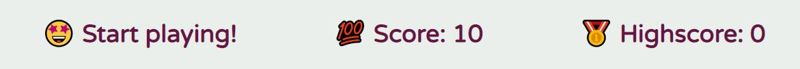

# Memory Royale

[View the live website here](https://michellegri.github.io/memory-royale/)

[GitHub Repo](https://github.com/MichelleGri/memory-royale)

***

## About

Memory Royale is an engaging and entertaining memory card game for tweens, children between 10-12 years old. It is based on the popular Disney movie Encanto. The cards include characters from the movie. The game’s overall aim is to entertain children in a game that engages and stimulates their minds to improve memory and information retention. 

## Index - Table of Contents

* [User Experience (UX)](#user-experience)
* [Designs](#designs)
* [Features](#features)
* [Technologies Used](#technologies-used)
* [Testing](#testing)
* [Deployment](#deployment)
* [Known Bugs](#known-bugs)
* [Acknowledgements](#credit)

***

## User Experience (UX)

## Strategy

The main goal of Memory Royale is to entertain and engage its users. The game’s target audiences are tweens (children aged between 10 and 12) and their parents. 

### Player goals

The main target audience for this game are tweens. These children are looking for:

* A fun and trendy game 
* Easy to understand and play
* Entertainment
* Achieve high scores

Memory Royale achieves these player needs by:

* Including a popular and trendy theme of Disney Encanto movie
* Children are able to engage with the game by discovering their favourite Encanto characters
* The game is easy to understand and play
* The high score function allows for motivation to continue playing and achieve higher scores

### Parents goals

Parents have the ability to control the games their children are exposed to and are allowed to play. Therefore, it is important to consider parents’ goals while designing the game. Parents’ goals are:

* A game that adds value to their child/children’s development
* A game that works well and is visually appealing

Memory Royale meets parents’ goals by:

* The game provides the ability for children to develop their memory skills
* It is simple and easy to use

***

## Designs

## Surface

### Colour Scheme
The game was created with a very simple colour scheme of light green and burgundy. A colour picker was used on the Encanto logo to select the colours:

Three colours were chosen for the colour palette using the website [Canva](http://canva.com/colors). The image below displays the three colours with their HEX, RGB, and CMYK values. HEX values have been used in style.css file. 

### Typography

Only one font, Varela Round, was imported from [Google Fonts](https://fonts.google.com/) into the style.css file to be used throughout the game. This font was chosen as it is appears soft and playful, and is easily readable for children. 

### Imagery

All imagery used within this game is relevant to the Disney movie Encanto. Emojis are also used to add playfulness and interest to the game.

#### Image Links

* [Encanto logo](https://logos.fandom.com/wiki/Encanto)

* [Mirabel](https://en.wikipedia.org/wiki/Mirabel_Madrigal)

* [Isabela](https://disneynews.us/character/isabela-madrigal-encanto/)

* [Luisa](https://www.piratesandprincesses.net/luisa-madrigal-has-become-incredibly-popular-with-many-encanto-fans/)

* [Antonio](https://disney.fandom.com/wiki/Antonio_Madrigal)

* [Bruno](https://en.wikipedia.org/wiki/Bruno_Madrigal)

* [Camilo](https://www.cosplaycentral.com/topics/cosplay/guide/how-to-make-an-encanto-cosplay-from-the-new-disney-movie)

## Skeleton

### Layout

* Layout of the site was designed with careful consideration to symmetry and spacing between all elements. The site follows symmetrical values of between 1 to 4 columns, depending on the device it is being viewed on. 

* The max-width for the entire site is set to 800 pixels. This is to ensure the it displays well on larger screen sizes. 

* Media queries have been applied at different screen-width break-points to ensure responsiveness. DevTools has been used to determine the break-points, which are set at points where the layout begins to distort.  Game cards columns decrease from 4 to 1 as screen sizes decrease, and the number of rows increases. 

***

## Features

### Header

The header appears at the top of the game page and includes three aspects: the game title "Memory Royale", a logo of the movie Encanto, and a ‘Play’ button. All these aspects are centred on the page to provide symmetry and consistency on the game page. The ‘Play!’ button allows the user to re-start the game at any point. 

### Score Area
The score area section includes three aspects: a message display that changes as the user plays the game, a score display, and a highscore display. Emojis have been added to all these messages to increase user interest and engagement with the game.

Message – the message changes according to the following rules:
When the user does not find a match between two cards:
“Keep guessing!”

When the user finds a match between two cards:
“That’s a match!”

When the user finishes the game by matching all cards:
“You won the game!”

When the user does not match all cards and the score equals to zero:
“Game Over!”

### Game Area
The game is the main feature of the game and includes the game board. It is set against a light green background. This colour was chosen from the Encanto logo. There are 12 cards, all facing down as the game starts. The cards are white with a Disney Encanto logo. The cards layout includes 3 rows and 4 columns.

#### Front Cards

#### Back Cards

### Future Features

* The game can include a selection of different themes to choose from. Buttons can be added to choose from different card decks. Examples of other themes may be other popular Disney or children’s movies: Turning Red, Luca, and Spiderman.

* The game can include different levels of difficulty – such as Easy, Medium, Hard. More or less cards can be placed on the game board depending on the level of difficulty.

***

## Technologies Used

* HTML5 – used to mark-up the website using semantics
* CSS3 – Cascading Style Sheets was used to create style
* JavaScript – used to add interactivity, game features, and playing functions
* Gitpod.io – creating the website by writing code; creating a progress log by making commits using the command line and pushing to GitHub
* GitHub – create a project repository

### Design

* [Google Fonts](https://fonts.google.com/)– for styling the typography 
* [Canva](https://www.canva.com/) - for colour scheme and image editing
* Microsoft Paint 3D – to resize and crop images 

### Testing 

* [HTML Validator](https://validator.w3.org/) – W3C Markup Validation - testing validity of HTML code
* [CSS Validator](https://jigsaw.w3.org/css-validator/) - W3C CSS Validation - testing validity of CSS code
* [JavaScript Validator](https://jshint.com/) - JS Hint - testing the validity of JavaScript code
* [Am I Responsive](http://ami.responsivedesign.is/#) – checking responsiveness of the site
* [Wave](https://wave.webaim.org/) - checking accessibility of the site
* [Browser Stack](https://www.browserstack.com/) - checking browser compatibility
* DEV Tools – Lighthouse check and responsiveness check on various screen sizes
* Microsoft Excel - to create testing plan and instructions

***

## Testing

Several tests were carried out to ensure the validity and usability of the game.

### HTML Validator

The [W3c Markup Validation Service](https://validator.w3.org/) was used to check validity of HTML markup of the game. The results are displayed below.

### CSS Validator

The [W3c CSS Validation Service](https://jigsaw.w3.org/css-validator/) was used to check validity of CSS code. The results are displayed below.

### JavaScript Validation

The JavaScript code was validated using the  validation service. The suggested corrections were implemented.

### Am I responsive?

The [Am I responsive](http://ami.responsivedesign.is/#) checker was used to test the responsive nature of the game on devices with different screen sizes. 

### Lighthouse Test

The Lighthouse Test on Developer Tools was used to test specific aspects of the website on desktop and mobile devices. 

#### Desktop

#### Mobile

#### Browser Compatibility

The game was tested on Chrome, Firefox, Internet Explorer, Microsoft Edge, and Safari. The developer carried out manual tests by installing theses browsers and checking the site's compatibility. In addition, the [Browser Stack](https://www.browserstack.com/) website was also used. However, the free version of Browser Stack allows for 1 minute of usage only on each browser. The tests revealed that the site is compatible with all Chrome, Firefox, and Microsoft Edge browsers. The site images appear as different sizes on older versions of Safari and Internet Explorer. However, the content is readable and the user is able to navigate through the game.

***

## Deployment

### Adding and Committing files in GitPod

To add files to the repository:
Type ‘git add .’ in the command line
Type ‘git commit -m “This is the commit message” 
Type ‘git push’

The git commit message should clearly describe the changes made. 

Pushing will send all work to the GitHub repository and automatically update changes made in GitPod to the deployed website. 

### Deployment

The steps below were followed to deploy this project:

* Logged into GitHub
* Clicked on the drop-down menu on the right top corner
* Clicked on ‘Your repositories”
* Clicked on the la-boulangerie repository
* Clicked on the Settings tab above the repository
* Clicked on the Pages link on the left side menu
* Under the “Source”, selected None from the dropdown menu and then selected “Master Branch”
* The page refreshed and a link to the deployed website appeared
* Clicked on the link to open the deployed website

## Known Bugs

* The main bug discovered was when the 'Play!' button was clicked to restart the game. The cards were taking longer to flip over than the shuffling to take place. Therefore, the play was able to see placement of the cards on a new game before they unflipped. This issue was resolved by adding a timeout method to the shuffling function. Now the shuffling takes place after all cards are unflipped. 

* The game was not ending when the score was decreased to zero. The score kept decreasing to negative numbers. This issue was resolved by add a 'game over' feature, and the game retarts after a few seconds.

* There are no other known bugs.

***

## Acknowledgements

### Credit

Brian Macharia - I would like to thank my mentor Brian Macharia for his valuable feedback and suggestions. His guidance enabled me to plan and execute the project. 

Tutor Support – I would like to thank the various tutors at the Code Institute tutor support for assisting me in solving problems and issues. 

#### Media

[Jonas Schmedtmann](https://www.udemy.com/course/the-complete-javascript-course/) - Udemy course - The Complete JavaScript Course 2022: From Zero to Expert

[Traversy Media](https://www.youtube.com/c/TraversyMedia) – YouTube Channel – for providing informative videos on various HTML, CSS and JavaScript topics

[Stack Overflow](https://stackoverflow.com/) – for trouble shooting and resolving code issues

[Google Fonts](https://fonts.google.com/) – for fonts used throughout the website

[Google Images](https://www.google.co.uk/imghp?hl=en&ogbl) - for Encanto logo and character images

[Canva](https://www.canva.com/) – for choosing a colour scheme

[W3school](https://www.w3schools.com/) – for HTML, CSS, and JavaScript coding information and trouble shooting

[HTML Validator](https://validator.w3.org/) – for testing validity of HTML code

[CSS Validator](https://jigsaw.w3.org/css-validator/) – for testing validity of CSS code

[JS Hint](https://jshint.com/) - for testing validity of JavaScript code

[Am I Responsive](http://ami.responsivedesign.is/) – for checking responsiveness on different screen sizes

[Wave](https://wave.webaim.org/) - for checking accessibility of the site

[Browser Stack](https://www.browserstack.com/) - for checking browser compatibility

***

### Content

Code and Content (not already attributed): Michelle Griffiths

